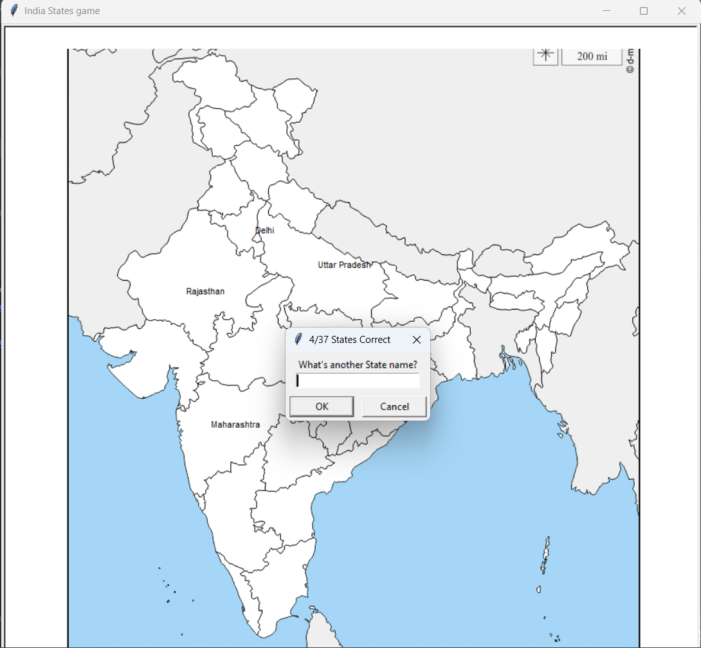

# India States Game 🇮🇳

A fun Python turtle game inspired by Angela Yu’s U.S. States Game.  
The goal of the game is to guess all the Indian states by typing their names.  
When you guess correctly, the state name appears on the map at its location.

---

## 🚀 How to Run

1. Clone or download the project folder.
2. Make sure you have Python installed (>=3.7).
3. Install dependencies:
   pip install pandas
4. Run the game:
   python main.py

---

## 📂 Project Structure

india-states-game/
│
├── main.py                 # Main game logic
├── india_states.csv        # Dataset containing state names and coordinates
├── india_map.gif           # Map of India (used as background)
├── states_to_learn.csv     # Auto-generated list of states you missed
└── README.md               # Project documentation

---

## 📊 Dataset (india_states.csv)

| state             | x    | y    |
|-------------------|------|------|
| Andhra Pradesh    | 100  | -150 |
| Arunachal Pradesh | 250  | 200  |
| Assam             | 200  | 150  |
| ...               | ...  | ...  |

*(Coordinates are approximate for game placement. You can adjust them as needed.)*

---

## 🖼️ Screenshot

---

## 📜 License

This project is licensed under the MIT License.  
You are free to use, modify, and distribute this project with attribution.

